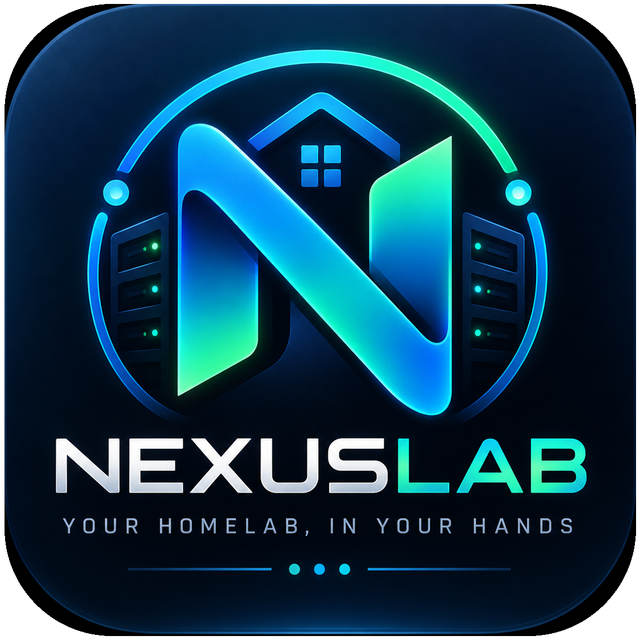
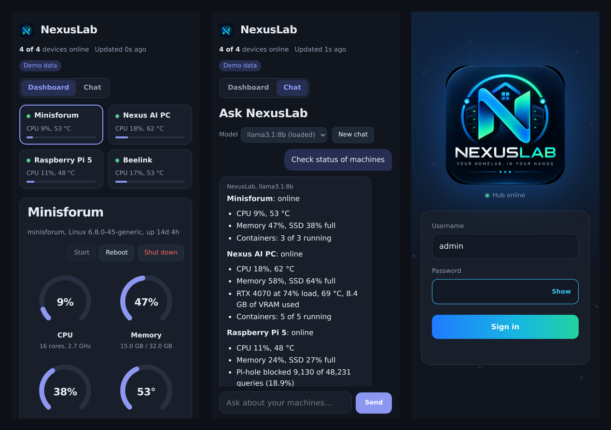
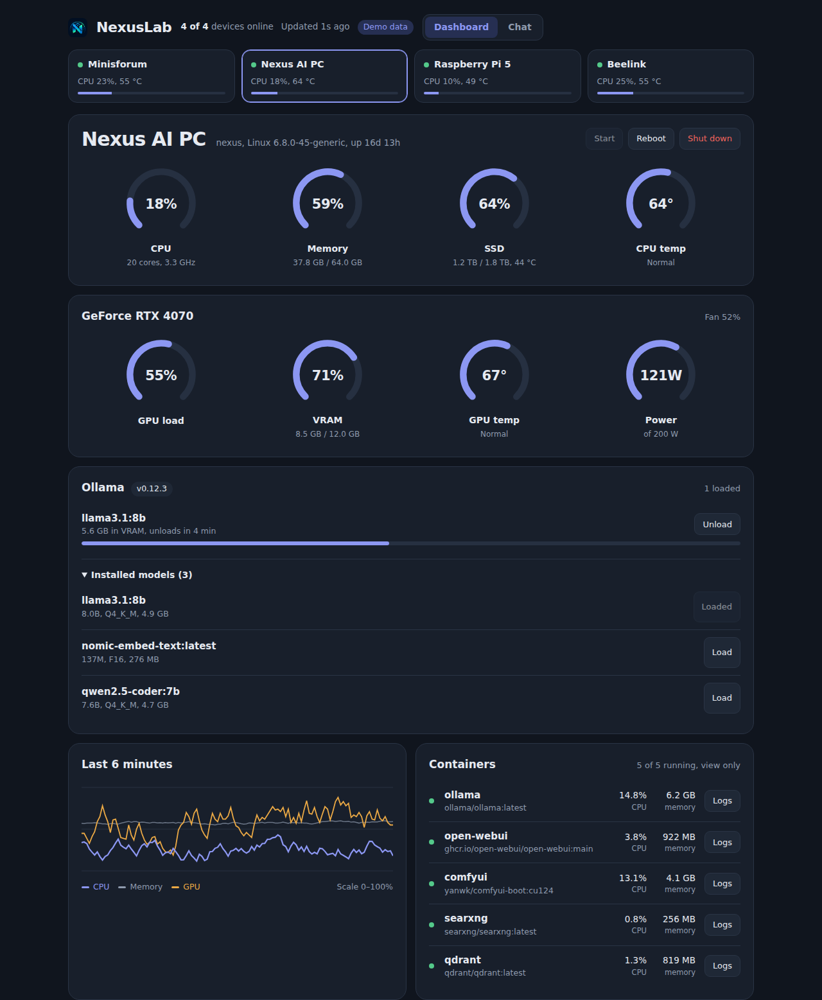
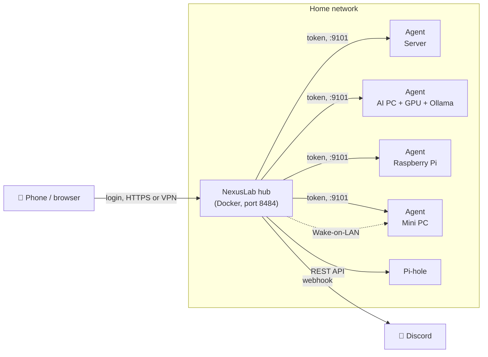

<p align="center">
  
</p>

<p align="center"><b>Your homelab, in your hands.</b><br>
A self-hosted dashboard for monitoring and controlling the machines in a homelab, from any browser or as an app on your phone.</p>

<p align="center">
  
</p>

## Features

- **Live monitoring:** CPU, memory, SSD usage and temperatures for every machine, refreshed every 3 seconds, with a 6-minute history chart.
- **NVIDIA GPU:** load, VRAM, temperature, power draw and fan speed.
- **Docker:** see every container's status, CPU and memory. Per machine, choose view-only (with logs) or full control (start, stop, restart).
- **Power control:** Start (Wake-on-LAN), Reboot and Shut down any machine. Works from anywhere over Tailscale or another VPN.
- **Pi-hole:** queries blocked, share blocked, blocklist size, clients and blocking status (v5 and v6).
- **Ollama:** loaded models and their VRAM use, plus one-tap Load and Unload.
- **Chat:** ask your own Ollama models "check status of machines" and get an answer based on live data from every machine.
- **Discord alerts:** machine offline, CPU or GPU running hot, container stopped, plus a daily summary. Recovery messages when problems clear.
- **Installable app:** custom icon and login screen. Add it to your phone's home screen and it opens like an app.

<p align="center">
  
</p>

## How it works



- **Agent** (`agent/`): a small Python service (FastAPI + psutil) that runs on each machine as a systemd service. It reports metrics and, when allowed, controls Docker and power. Every request needs the agent's token.
- **Hub** (`hub/`): runs in Docker on one always-on machine. It polls every agent, serves the dashboard, handles the login, sends Discord alerts and proxies the chat to Ollama. Only the hub talks to the agents; your browser only talks to the hub.

## Quick start

You need Linux machines with Python 3.9+ and systemd, plus Docker on the machine that runs the hub.

**1. On every machine, install the agent**

```bash
git clone https://github.com/YOUR_USERNAME/nexuslab.git
cd nexuslab/agent
sudo DOCKER_MODE=monitor ./install-agent.sh   # off | monitor | control
```

The installer prints a token. Save it for step 2.

**2. On the always-on machine, configure and start the hub**

```bash
cd nexuslab/hub
cp config.example.yaml config.yaml
nano config.yaml          # add each machine's IP and token, and set a password
docker compose up -d --build
```

**3. Open** `http://<hub-ip>:8484` and sign in.

The full walkthrough, including Pi-hole, Discord, Wake-on-LAN and adding it to your phone, is in **[docs/INSTALL.md](docs/INSTALL.md)**.

To try the interface without any hardware, open `hub/static/index.html?demo` through any local web server, or visit `http://<hub-ip>:8484/?demo`.

## Documentation

| Guide | What's in it |
|---|---|
| [Installation](docs/INSTALL.md) | Step-by-step setup for agents, hub, Pi-hole, Discord, Wake-on-LAN and the phone app |
| [Configuration](docs/CONFIGURATION.md) | Every option in `config.yaml` and the agent's settings |
| [API](docs/API.md) | Hub and agent endpoints |
| [Troubleshooting](docs/TROUBLESHOOTING.md) | Fixes for the problems you're most likely to hit |

## Security

- Keep ports **8484** (hub) and **9101** (agents) on your home network. Don't forward them on your router; use Tailscale, WireGuard or similar to reach NexusLab from outside.
- Always set `auth.password`. The dashboard can stop containers and shut down machines.
- Agents refuse any request without their token. Container control is enforced by each agent itself, so a `monitor` machine can't be controlled even if the hub is misconfigured.
- `config.yaml` and `hub/data/` hold your secrets and are excluded by `.gitignore`. Never commit them.

## Project layout

```
agent/          Runs on every machine
  agent.py              metrics, Docker, power, Ollama and Wake-on-LAN setup
  install-agent.sh      installs it as a systemd service
hub/            Runs once, in Docker
  app.py                polling, alerts, login, chat, API
  static/               dashboard, login page, icons
  config.example.yaml   copy to config.yaml
docs/           Guides and screenshots
```

## License

[MIT](LICENSE)
